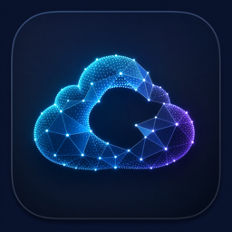

# CloudPoint



> Local 3D reconstruction for Mac

CloudPoint turns a video recording or live camera feed into spatial scene data
on Apple Silicon. Choose multi-frame LingBot-Map point clouds through Apple MLX
or experimental single-frame Apple SHARP Gaussian scenes through PyTorch MPS.
Both viewers are native Metal, and every project is autosaved in a `.cloudpoint`
package.

## What CloudPoint 1.1 does

- Opens MOV, MP4, and M4V recordings directly—there is no blank project to
  save first.
- Offers a source-first choice between a **Point Cloud** and an experimental
  **Gaussian Scene**; no project is created until a mode is chosen.
- Runs real LingBot-Map depth and camera inference locally with MLX for
  multi-frame recordings and live feeds. CUDA is not required.
- Runs Apple's official SHARP model locally with MPS, plus a slower CPU retry,
  to create a metric 3D Gaussian scene from a selected video frame or a camera
  snapshot.
- Ranks seven video key frames for SHARP and provides a live preview with
  one-click **Capture & Reconstruct** for cameras.
- Displays point clouds and Gaussian splats in native interactive Metal viewers
  with orbit, pan, zoom, reset, project sharing, and standalone PLY export for
  Gaussian scenes.
- Autosaves frames, predictions, geometry, model provenance, and reconstruction
  checkpoints in a `.cloudpoint` package.
- Reopens recent projects and restores validated committed output. Interrupted
  LingBot work resumes from the last committed window.
- Verifies pinned models with guided, mode-specific setup flows.

Point Cloud mode produces colored points, not a watertight textured mesh.
Gaussian Scene mode is nearby-view synthesis from one image, not multi-view
SLAM, photogrammetry, or a complete 360-degree capture. SHARP is experimental
and governed by Apple's research-model license.

## Requirements

- An Apple Silicon Mac (M-series)
- macOS 15.0 or newer
- An internet connection for the initial model download
- About 8 GiB free for LingBot setup, or 6 GiB for SHARP setup

The release does not contain model weights. Each mode has its own guided setup.
LingBot setup downloads and verifies a 4.32 GiB checkpoint, then converts it
locally into 2.16 GiB of MLX-compatible weights. SHARP setup displays Apple's
research-model license before downloading and verifying its 2.62 GiB
checkpoint. Reconstruction is local after setup.

## Install the app

1. Download `CloudPoint-v1.1.0-macOS-arm64.zip` from the
   [latest release](https://github.com/moebis/cloud.point.cloud/releases/latest).
2. Unzip it and move `CloudPoint.app` to `/Applications`.
3. The v1.1.0 build is ad-hoc signed and is not Apple-notarized. On first
   launch, Control-click or right-click the app in Finder, choose **Open**, and
   confirm macOS's prompt.

Only use a release downloaded from this repository. A notarized Developer ID
build is not included in v1.1.0.

## Make a reconstruction

1. Launch CloudPoint and choose **Open Video…**, press Command-O, drag a video
   onto the welcome window, or open a supported movie with CloudPoint from
   Finder.
2. Choose **Point Cloud** for a multi-frame map, or **Gaussian Scene** for Apple
   SHARP. Video SHARP mode recommends key frames, and you can select another.
3. If setup is required, follow the mode-specific download flow. SHARP asks you
   to accept Apple's research-model terms. CloudPoint verifies the exact pinned
   checkpoint and continues automatically.
4. CloudPoint creates and autosaves the project under Application Support. You
   never need to choose a name or save location before reconstruction.
5. Return to **All Projects** to reopen an autosaved project, or use **Share
   Project**. Gaussian projects also offer **Export PLY**.

For live input, choose **Use Camera**, grant access, review the preview, and
choose a mode. Point Cloud uses continuous 1–10 fps capture; **Stop Capture**
ends input but drains already captured frames. Gaussian Scene uses one live
snapshot when you press **Capture & Reconstruct**.

### Supported recordings

CloudPoint accepts `.mov`, `.mp4`, and `.m4v`. Decoding uses AVFoundation, so
the video track must use a codec available on the Mac; a supported extension
alone does not guarantee that every file can be decoded.

## Projects and privacy

Video frames and scene inference stay on the Mac. The only production network
operation is an explicit model download during setup.

CloudPoint does not copy the original recording into the project. It stores a
secure reference to the source plus selected JPEG frames and derived data. Keep
the source available until a multi-frame import finishes. A package contains:

```text
Example-<uuid>.cloudpoint/
├── Manifest.json
├── Frames/
├── Predictions/
├── Points/
├── Outputs/Gaussians/
└── Logs/
```

Manifests and reconstruction output are committed atomically. Project packages
can become large because they retain durable inputs and output.

## How it works

1. Swift and AVFoundation orient and persist selected recording or camera
   frames.
2. A bundled relocatable Python runtime launches a separate mode-specific
   worker with a verified external model.
3. LingBot-Map uses MLX for multi-frame depth, camera, and point geometry;
   Apple SHARP uses MPS or CPU for a single-image Gaussian PLY.
4. Output and provenance are validated and committed atomically before the
   native Metal point or Gaussian viewer opens them.

The workers bind no network ports. Their standard-I/O protocols isolate the
native UI, project transactions, and machine-learning runtimes.

## Build from source

Development requires Xcode with the macOS 15 SDK and Swift 6, plus
[`uv`](https://docs.astral.sh/uv/) for the locked Python environment:

```sh
scripts/bootstrap
open CloudPoint.xcodeproj
```

Select the **CloudPoint** scheme and **My Mac** in Xcode. To bootstrap, build,
and launch a Debug app in one command:

```sh
scripts/run-first-version
```

Run the native test gate with:

```sh
scripts/bootstrap
scripts/test-native
```

See [Development](docs/DEVELOPMENT.md) for worker tests, real-model integration,
release packaging, and the developer-only deterministic test engine.

## Models and upstream provenance

CloudPoint pins both inference implementations and their model trust anchors.
Model weights are excluded from the source repository and compiled app.

- [LingBot-Map source](https://github.com/Robbyant/lingbot-map/tree/7ff6f3ed0913d4d326f8f13bbb429c4ffc0195c2)
- [Pinned LingBot model](https://huggingface.co/robbyant/lingbot-map/tree/204754b72bb24f561f8d7e7e1e4e4cd9e809adf9)
- [Apple MLX](https://github.com/ml-explore/mlx)
- [Apple SHARP source](https://github.com/apple/ml-sharp/tree/1eaa046834b81852261262b41b0919f5c1efdd2e)
- [MetalSplatter](https://github.com/scier/MetalSplatter/tree/71ff248e3016ac43c0a9271e322538421b28c360)

LingBot-Map and its model are Apache-2.0. SHARP source and the separately
downloaded checkpoint have different Apple research terms. See
[Third-party notices](THIRD_PARTY_NOTICES.md) for exact commits, checksums, and
license boundaries.

## License

CloudPoint is licensed under the [Apache License 2.0](LICENSE). Third-party
components and separately downloaded models remain subject to their own terms.
